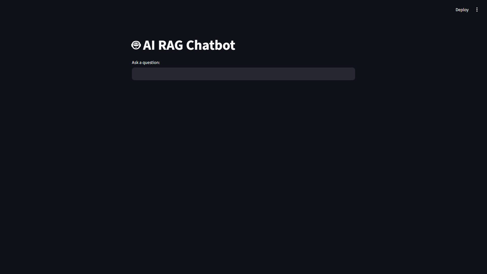
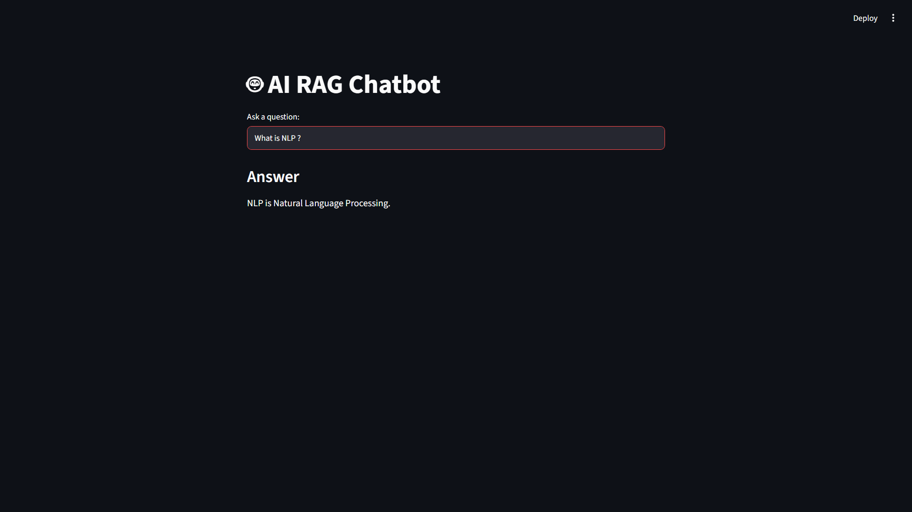

#  AI RAG Chatbot

An AI-powered **Retrieval-Augmented Generation (RAG)** chatbot that answers user queries using custom documents. The application combines semantic search with **Google Gemini**, **LangChain**, **Hugging Face Embeddings**, and **ChromaDB** to provide accurate, context-aware responses through an interactive Streamlit interface.

---

##  Features

- Retrieval-Augmented Generation (RAG)
- Query custom documents using natural language
- Semantic search with vector embeddings
- AI-powered responses using Google Gemini
- Interactive Streamlit web interface
- Fast document retrieval with ChromaDB
- Docker support for containerized deployment

---

##  Tech Stack

| Technology              | Purpose              |
| ----------------------- | -------------------- |
| Python                  | Backend Development  |
| Streamlit               | User Interface       |
| LangChain               | RAG Pipeline         |
| Google Gemini API       | Large Language Model |
| Hugging Face Embeddings | Text Embeddings      |
| ChromaDB                | Vector Database      |
| Docker                  | Containerization     |

---

##  Project Structure

```text
AI_RAG_CHATBOT/
├── docs/
├── app.py
├── ingest.py
├── requirements.txt
├── Dockerfile
├── .env.example
├── .gitignore
└── README.md
```

---

##  Getting Started

### Prerequisites

- Python 3.11+
- Google Gemini API Key

### Installation

Clone the repository:

```bash
git clone https://github.com/dodiyariya6/ai-rag-chatbot.git
cd ai-rag-chatbot
```

Create a virtual environment:

```bash
python -m venv ragbot
```

Activate the virtual environment:

**Windows**

```bash
.\ragbot\Scripts\Activate.ps1
```

Install dependencies:

```bash
pip install -r requirements.txt
```

Create a `.env` file:

```env
GOOGLE_API_KEY=YOUR_GOOGLE_API_KEY
```

Index the documents:

```bash
python ingest.py
```

Run the application:

```bash
streamlit run app.py
```

The application will be available at:

```text
http://localhost:8501
```

---

##  Demo

### Home Screen



### Chat Example



---

##  Future Improvements

- Support for PDF, DOCX, and multiple document formats
- Conversation memory
- Multi-document collections
- User authentication
- Cloud deployment

---

##  License

This project is developed for educational and learning purposes.
